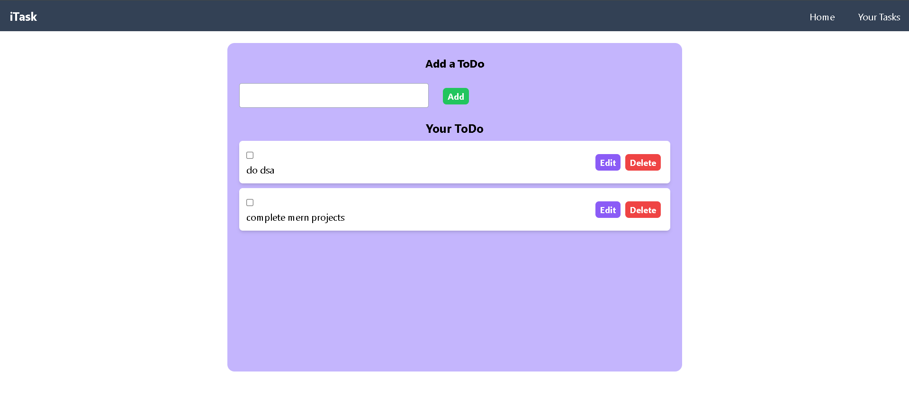
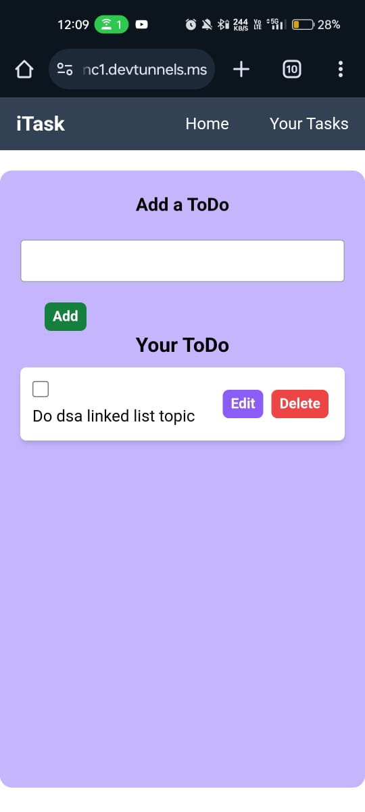

# 📝 React & MongoDB ToDo List

A full-stack **ToDo List** app built with **React.js** for the frontend and **MongoDB** for the backend database.  
Add, delete, and track your daily tasks efficiently!

---

## 📸 Screenshots

### Web View


### Mobile View


---

## 🚀 Features

- Add new tasks
- Mark tasks as completed
- Delete tasks
- Responsive UI for mobile and desktop
- MongoDB Atlas as database (or Local MongoDB)

---

## 🛠️ Tech Stack

- **Frontend:** React.js, Tailwind CSS / CSS
- **Backend:** Node.js, Express.js
- **Database:** MongoDB
- **Others:** Axios (for API calls)

---

## 📦 Setup Instructions

1. **Clone the repository:**

```bash
git clone https://github.com/your-username/your-repo-name.git
cd your-repo-name
